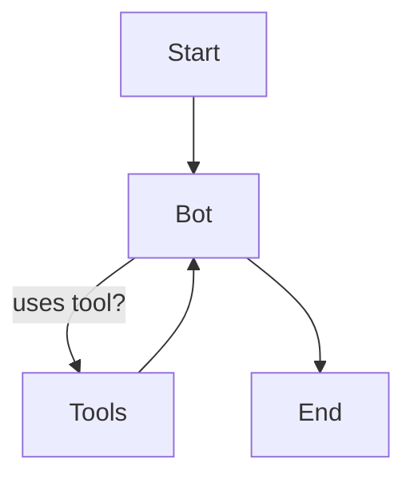

# 🛠️ ChatBot with Multiple Tools using LangGraph

A professional, modular chatbot built with [LangGraph](https://github.com/langchain-ai/langgraph), [LangChain](https://github.com/langchain-ai/langchain), and [Groq LLM](https://groq.com/).  
This notebook demonstrates how to create a conversational agent that can dynamically use external tools like Wikipedia and Arxiv for enhanced responses.

---

## 🚀 Features

- **Multi-tool Integration:**  
  Seamlessly query Wikipedia and Arxiv within your chatbot conversations.
- **LLM-Powered:**  
  Uses Groq's Llama-3.3-70b-versatile model for natural, context-aware responses.
- **Graph-based Workflow:**  
  Utilizes LangGraph's stateful, conditional graph execution for flexible conversation flows.
- **Extensible Design:**  
  Easily add more tools or swap out LLMs as needed.

---

## 📦 Requirements

- Python 3.8+
- `langchain`
- `langgraph`
- `langchain_community`
- `langchain_groq`
- `python-dotenv`
- `IPython` (for notebook display)

Install dependencies:
```bash
pip install langchain langgraph langchain_community langchain_groq python-dotenv ipython
```

---

## 🧩 How It Works

1. **Tool Setup:**  
   - Wraps Wikipedia and Arxiv APIs as LangChain tools.
2. **LLM Binding:**  
   - Binds the tools to a Groq LLM for tool-augmented responses.
3. **Graph Construction:**  
   - Defines a stateful graph with nodes for the bot and tools, using conditional edges for dynamic tool invocation.
4. **Visualization:**  
   - Renders the conversation flow as a Mermaid diagram.
5. **Streaming Interaction:**  
   - Streams user input through the graph, printing each response.

---

## ⚙️ Usage

1. **Set your Groq API key** in a `.env` file:
    ```
    Groq_api=YOUR_GROQ_API_KEY
    ```

2. **Run the notebook** cell by cell.

3. **Ask questions!**  
   The bot will automatically use Wikipedia or Arxiv when needed.

---

## 📝 Example

```python
user_input = "What is Langchain?"
events = graph.stream(
    {"messages": [("user", user_input)]}, stream_mode="values"
)
for event in events:
    event["messages"][-1].pretty_print()
```

---

## 📊 Architecture



---

## 🤝 Credits

- [LangChain](https://github.com/langchain-ai/langchain)
- [LangGraph](https://github.com/langchain-ai/langgraph)
- [Groq](https://groq.com/)
- [Wikipedia](https://www.wikipedia.org/)
- [Arxiv](https://arxiv.org/)

---

## 📄 License

MIT License
